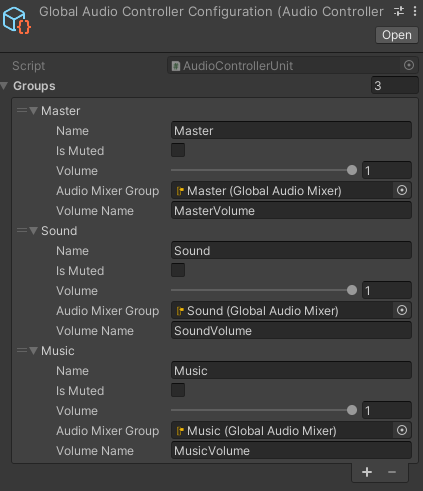
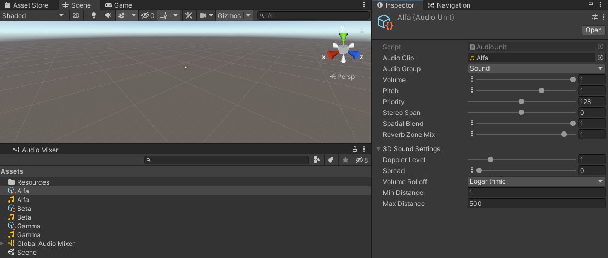
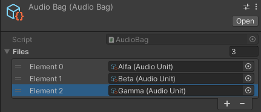

# Unity Audio Manager

A manager of audio clips for Unity that simplify the process of playing audio clips.

First create a global configuration and store it in the `Resources` folder, this is the only file that *must* be stored in that folder to work:



The global configuration allow to create groups of audios so their volume can be configured individually.

Then create individual `Audio Unit`s for each `AudioClip` and configure those clips at will.



You can additionaly create `AudioBag`s to play an audio randomly from a collection or `AudioSequence`s to play audio files in an specific order.



Finally, use the class `AudioController` as the entry point for the rest of the API.
Which provides methods to read and set volume, and play audios in an specific location or following a `Transform`.

```cs
namespace Enderlook.Unity.AudioManager
{
    /// Global controller of the audio manager.
    public sealed class AudioController : MonoBehaviour
    {
        /// Determines if the game is muted.
        public static bool MasterIsMuted { get; set; }

        /// Global modifier of all audios.
        public static float MasterVolume  { get; set; }

        /// Global audio mixter group.
        public static AudioMixerGroup MasterAudioMixerGroup { get; }

        /// Determines if an audio group is muted.
        public static bool GetMuted(string audioGroupName);

        /// Determines if an audio group is muted.
        public static bool SetMuted(string audioGroupName, bool isMuted);

        /// Get the volume of an audio group.
        public static float GetVolume(string audioGroupName);

        /// Set the volume of an audio group.
        public static void SetVolume(string audioGroupName, float volume);

        /// Get the audio mixer group of an audio group.
        public static AudioMixerGroup GetAudioMixerGroup(string audioGroupName);

        /// Play an audio once on the specified location.
        public static AudioPlay PlayOneShoot(AudioFile audioFile, Vector3 location = default);

        /// Play an audio once following the specified transform position.
        public static AudioPlay PlayOneShoot(AudioFile audioFile, Transform transform = default);

        /// Play a looped audio on the specified location.
        public static AudioPlay PlayLoop(AudioFile audioFile, Vector3 location = default);

        /// Play a looped audio following the specified transform position.
        public static AudioPlay PlayLoop(AudioFile audioFile, Transform transform = default);
    }

    /// <summary>
    /// A handle that represent the playing of an <see cref="AudioFile"/>.
    /// This handle should not be copied. It should be treated with move semantics.
    /// </summary>
    public struct AudioPlay
    {
        /// Configures the relative volume of the audio source.
        public float Volume { get; set; }
        
        /// Determines if this instance is default.
        public bool IsDefault { get; }
        
        /// Determines if audio is paused.
        public bool IsPaused { get; }

        /// Determines if audio is stopped, which is not the same as if the audio has finallized.
        public bool IsStopped { get; }
        
        /// Stop the execution of an audio. If the audio was paused, its duration is reseted.
        public void Stop();
        
        /// Pause the execution of an audio.
        public void Pause();
        
        /// Reanude the execution of an audio if <see cref="Pause"/> was executed.
        /// Start from zero if has <see cref="Stop"/> was executed.
        /// Start from zero if audio has finalized.
        public void Play();
    }
}
```